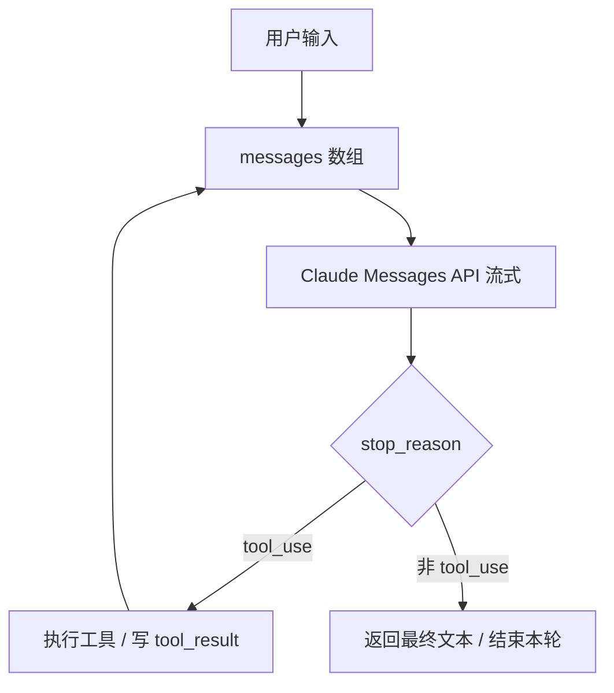

# Claude Code — 主体架构

## 1. 定位与运行时

- **形态**：终端内的 AI 编程助手 CLI，技术栈以 **TypeScript + React/Ink** 为主，构建使用 **Bun**（`bun:bundle` 的 `feature()` 为**编译期**开关），产物为面向 **Node.js ≥ 18** 的单文件 `cli.js`（约 12MB）。
- **规模量级**（来自原仓库统计）：约 1884 个 `.ts/.tsx` 文件、`query.ts` 单文件极大（约 785KB）、内置工具 40+、斜杠命令 80+。

## 2. 核心抽象：Agent 循环

最小循环与产品化封装的关系可以概括为：

Claude Code 在循环外叠加：**权限**、**流式与并发工具执行**、**上下文压缩（compact）**、**子 Agent**、**会话持久化**、**MCP**、**遥测与远程配置** 等「生产级 harness」。

## 3. 入口分层

### 3.1 `src/entrypoints/cli.tsx`（最外层 CLI）

- **职责**：在加载完整 CLI 之前处理**快路径**（如 `--version` 无额外 import）、Chrome/MCP 相关子模式、`--daemon-worker`（内部）、`remote-control` / `bridge`（功能门控）、再进入 `main.tsx` 或 headless 路径。
- **特点**：大量使用 **dynamic import**，缩短冷启动；顶部可设置子进程堆、Corepack 等环境变量。

### 3.2 `src/main.tsx`（交互式主程序）

- **职责**：Commander 参数解析、OAuth/策略/远程托管设置、GrowthBook、MCP 预取、`launchRepl` 等 **REPL 启动**；与 `init`、`bootstrap/state`、全局配置强耦合。
- **侧效**：文件头部刻意提前执行 MDM 读取、钥匙串预取等，与启动性能相关。

### 3.3 `src/QueryEngine.ts`（无头 / SDK 查询生命周期）

- **职责**：把原先集中在 `ask()` 里的「一轮多 turn」逻辑抽成 **可复用类**：`submitMessage()` 驱动对话，在会话内保持 `mutableMessages`、用量统计、权限拒绝记录、文件读缓存等。
- **协作**：组装系统提示片段（`fetchSystemPromptParts`）、`processUserInput` 处理斜杠命令、核心循环委托给 **`query()`**（`query.ts`），通过 **AsyncGenerator** 产出 `SDKMessage` 流。
- **扩展点**：`QueryEngineConfig` 含 `canUseTool`、`mcpClients`、`snipReplay`（HISTORY_SNIP）等，便于 SDK 与 REPL 行为差异。

### 3.4 `src/entrypoints/` 其他入口

- **`sdk/`**：对外 Agent SDK（会话类型、schema 等）。
- **`mcp.ts`**：作为 MCP server 时的入口。
- **`init.js`**：全局初始化与遥测信任门槛等。

## 4. 查询管道（单轮生命周期）

与源码 README 中的数据流一致，精炼为：

1. **用户输入** → `processUserInput()`：解析 `/command`，可能产生本地命令输出或改写消息。
2. **系统提示** → `fetchSystemPromptParts()`：工具列表、CLAUDE.md / memory、模型相关片段等。
3. **持久化** → `recordTranscript()` 等：JSONL 会话记录。
4. **归一化** → `normalizeMessagesForAPI()`：去掉 UI 专用字段，必要时触发 compact。
5. **API** → 流式 `messages`：content block 增量到达。
6. **工具** → `StreamingToolExecutor`：按 **并发安全** 分区并行或串行执行；每条路径经 **`canUseTool`**（规则 + Hook + UI）。
7. **结果写回** → `tool_result` 追加到 `messages`，继续循环直到非 `tool_use` 停止。

### 4.1 `query.ts` 的角色

- **事实上的「主循环实现中心」**：导入 compact、遥测、GrowthBook、hooks、`runTools` / `StreamingToolExecutor`、token 预算等，体积巨大。
- **依赖注入**：通过 `query/config.js`、`query/deps.js`（`productionDeps`）等组织可测试边界。

### 4.2 工具执行：`StreamingToolExecutor` + `toolOrchestration`

- **`StreamingToolExecutor`**：流式到达的 `tool_use` 块进入队列；**并发安全**工具可并行，非并发工具独占；维护 **sibling AbortController**（例如 Bash 出错时结束兄弟子进程）；结果按接收顺序缓冲再产出。
- **`runTools`**：与 orchestration、hooks 配合的批量执行层（详见 `services/tools/`）。

## 5. 工具与权限（架构级）

- **统一类型**：`Tool.ts` 定义 `Tool` / `ToolUseContext` / 权限上下文、`buildTool` 工厂及渲染、校验、`call()` 等契约。
- **注册表**：`tools.ts` 中 `getAllBaseTools()` 汇总内置工具；大量工具通过 **`feature('…')`** 或 `USER_TYPE === 'ant'` **条件 require**，与发布包 DCE 一致。
- **权限链**（概念顺序）：`validateInput` → **PreToolUse Hooks** → **alwaysAllow / alwaysDeny / alwaysAsk 规则** → 交互式确认 → `checkPermissions()`（工具内沙箱逻辑）→ `call()`。

## 6. 状态与 UI

- **`state/AppStateStore.ts` + `AppState.tsx`**：集中式 **DeepImmutable** 应用状态：设置、模型、权限模式、MCP 连接、任务与 teammate UI、推测执行（speculation）、footer 焦点等。
- **`components/`**：Ink/React 终端 UI；与 `hooks/`（如 `useCanUseTool`）配合。

## 7. Feature 门控与源码完整性

- **`bun:bundle` 的 `feature('FLAG')`**：内部构建为 `true`、npm 包为 `false`，构建期 **死代码消除**。
- **后果**：README 所列约 **108 个模块**在公开包中**不存在**（如部分 `daemon/`、`assistant/`、`contextCollapse/`、`skillSearch/` 等）；阅读时若 `require` 指向缺失文件，属预期现象。
- **本仓库**：解包后的 `src/` 为未再打包的 TS 源码，**仍不一定能直接编译**（路径别名、内部宏等），以阅读架构为主。

## 8. 与其他横切能力的关系（简表）

| 能力 | 主要落点 |
|------|-----------|
| MCP | `services/mcp/*`，工具侧 `MCPTool` 等 |
| 压缩 / 上下文 | `services/compact/*`，`query.ts` 内 auto-compact |
| 遥测 / GrowthBook | `services/analytics/*`，`utils/telemetry/*` |
| 远程托管设置 / 策略 | `services/remoteManagedSettings/*`，`services/policyLimits/*` |
| OAuth | `services/oauth/*` |
| Bridge / 远程会话 | `bridge/*`，CLI 子命令（门控） |
| 插件 / Skills | `services/plugins/*`，`utils/plugins/*`，`SkillTool`，`skills/bundled` |

---

**下一篇**：[02-模块设计.md](./02-模块设计.md)（一级地图）· [00-模块分篇索引.md](./00-模块分篇索引.md)（20 篇分模块详解，均在本目录根下）。
