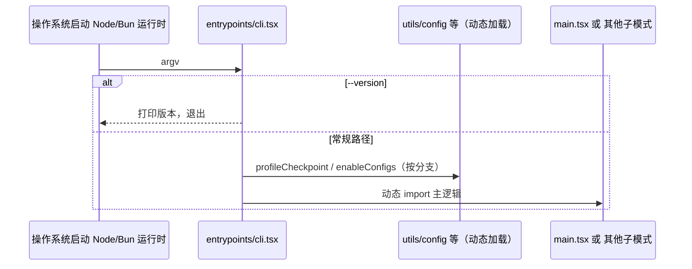

# 01 — 入口、Bootstrap 与初始化

## 1. 模块定位与边界

| 项目 | 说明 |
|------|------|
| **职责** | 进程最早期入口分流、全局副作用最少的快路径、跨入口共享的 **session/bootstrap 状态**、在重模块加载前完成的初始化钩子。 |
| **不包含** | REPL 业务编排（见 `02-主程序与REPL外壳.md`）、Agent 循环（见 `03`）、工具实现（见 `04`）。 |
| **物理路径** | `E:\claude-code-source-code\src\entrypoints\`、`src\bootstrap\`、`src\entrypoints\init.ts` |

## 2. 设计目标

1. **冷启动性能**：`--version` 等路径避免拉取整棵依赖树（`cli.tsx` 中动态 `import`）。
2. **安全与合规前置**：OAuth/遥测信任门槛在 `init.ts` 等与产品策略对齐。
3. **单例会话态**：`bootstrap/state.ts` 集中 `sessionId`、部分计数器与全局开关，供 `query/config.ts`、`toolExecution` 遥测等读取，避免在 `query.ts` 内散落 `process.env` 解析。

## 3. 文件清单

### 3.1 `entrypoints/`

| 文件 | 作用 |
|------|------|
| `cli.tsx` | **主 CLI 入口**：解析 `argv`，快路径（version、Chrome MCP、daemon worker、bridge、dump-system-prompt 等），再 `import` `main` 或 headless；顶部可设 `NODE_OPTIONS`、`COREPACK_ENABLE_AUTO_PIN`、`ABLATION_BASELINE` 环境变量。 |
| `init.ts` | 应用级 `init()`：配置、遥测门闸、与 `initializeTelemetryAfterTrust` 等衔接（被 `main.tsx` 引用）。 |
| `mcp.ts` | 以 **MCP Server** 身份启动时的入口（与交互 CLI 分离）。 |
| `agentSdkTypes.ts` | SDK 消息、权限、compact 等 **对外类型**，供 `QueryEngine`、SDK 消费者使用。 |
| `sandboxTypes.ts` | 沙箱相关类型（与 entrypoint 约束配合）。 |
| `sdk/coreSchemas.ts`、`sdk/controlSchemas.ts`、`sdk/coreTypes.ts` | SDK 控制面与核心 schema，减少循环依赖。 |

### 3.2 `bootstrap/`

| 文件 | 作用 |
|------|------|
| `state.ts` | **全局 bootstrap 状态**：`getSessionId`、`isSessionPersistenceDisabled`、工具耗时累计、`getCurrentTurnTokenBudget` 等与一轮/多轮查询相关的跨模块字段（`QueryEngine`、`query.ts`、`services/tools/toolExecution` 均依赖）。 |

## 4. 实现过程（运行时序）

1. **进程启动**：`cli.tsx` 的 `main()` 读取 `process.argv.slice(2)`。
2. **快路径判断**：仅 version 时直接 `console.log(MACRO.VERSION)` return。
3. **子模式**：`--claude-in-chrome-mcp`、`--chrome-native-host`、`--computer-use-mcp`（门控）等各自 `import` 专用模块并 `return`。
4. **内部 worker**：`--daemon-worker`（`feature('DAEMON')`）走 `daemon/workerRegistry`（公开包常无实现）。
5. **Bridge**：`remote-control` / `rc` / `bridge` 等在门控内初始化 config 后进入 bridge 流程。
6. **默认路径**：加载 `main.tsx`（或等价），其间 `init.ts` 完成信任与遥测相关初始化；会话 id 等在首次需要时经 `bootstrap/state` 暴露。

## 5. 与上下游接口

| 上游 | 下游 |
|------|------|
| 操作系统、npm 包 bin 指向的 `cli.js` | `main.tsx`、`QueryEngine`、MCP 专用入口 |
| `utils/config`、`utils/startupProfiler` | 全局配置与性能埋点 |
| `bun:bundle` 的 `feature()` | 编译期裁剪分支，影响本层可见代码路径 |

## 6. 配置、环境变量与门控

- **`feature('DUMP_SYSTEM_PROMPT')`**、`feature('DAEMON')`、`feature('BRIDGE_MODE')`、`feature('CHICAGO_MCP')` 等：决定整段代码是否进入 bundle。
- **`process.env.CLAUDE_CODE_REMOTE`**：远程 CCR 环境下调大子进程堆（`cli.tsx` 顶部）。
- **`USER_TYPE === 'ant'`**：内部构建标识，与 tools/commands 中条件 require 联动（非 `feature()`，多为测试/内部包）。

## 7. 阅读源码建议顺序

1. `entrypoints/cli.tsx`（从头读到第一个 `import('../main...')` 分支）。
2. `entrypoints/init.ts`（与 `main.tsx` 开头 import 对照）。
3. `bootstrap/state.ts`（记下导出的 getter，之后在 `query/config.ts`、`toolExecution.ts` 里看调用点）。

## 8. 文档维护说明

- 若升级版本，优先 diff **`cli.tsx` 新增 argv 分支** 与 **`init.ts` 遥测/信任逻辑**。
