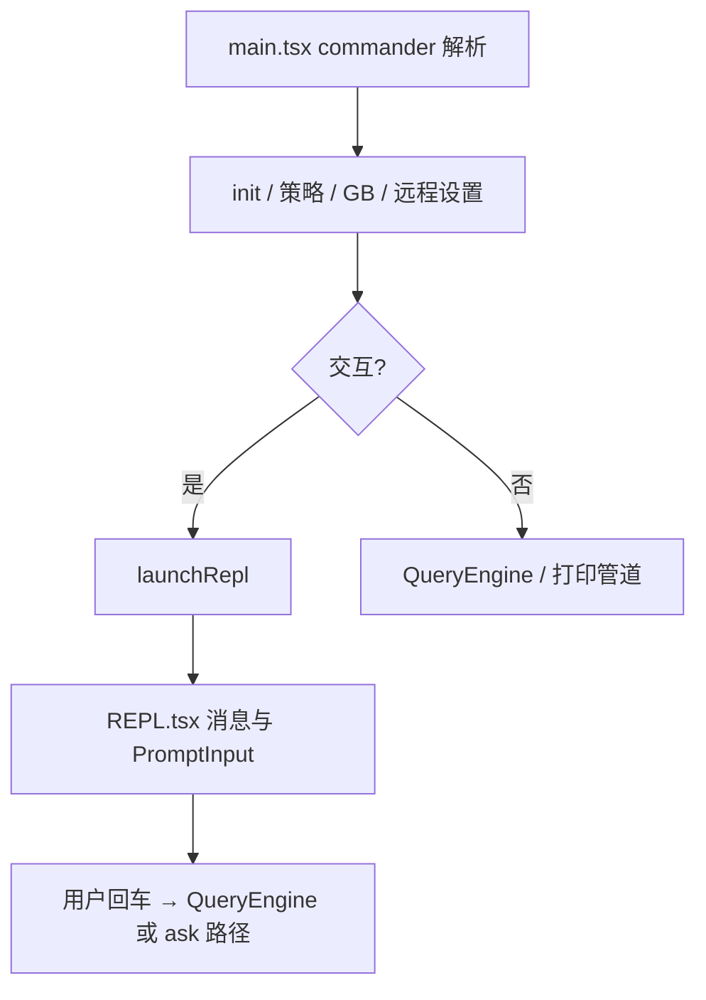

# 02 — 主程序与 REPL 外壳

## 1. 模块定位与边界

| 项目 | 说明 |
|------|------|
| **职责** | Commander **子命令与全局选项**、登录/配额/策略预取、**启动 Ink REPL**、各类模态对话框（resume、settings、teleport 等）的启动器、与 GrowthBook / 远程设置 / MCP 预取的编排。 |
| **不包含** | 单轮对话内逻辑（`QueryEngine`/`query.ts`）、单工具执行（`services/tools`）。 |
| **核心文件** | `src/main.tsx`（体量极大）、`replLauncher.tsx`、`interactiveHelpers.tsx`、`dialogLaunchers.tsx`、`setup.ts`、`cost-tracker.ts`、`history.ts`、`context.ts` |

## 2. 设计目标

1. **把「产品外壳」与「Agent 内核」分离**：`main.tsx` 负责 argv、权限产品策略、会话文件下载等；真正对话循环在 `REPL` + `QueryEngine`。
2. **启动并行化**：文件头通过 `startMdmRawRead`、`startKeychainPrefetch` 等与 macOS 钥匙串/MDM 并行，减少串行阻塞（见 `main.tsx` 顶部注释）。
3. **可测试的渲染边界**：`interactiveHelpers` 提供 `renderAndRun`、`getRenderContext` 等，把 Ink 渲染与业务决策分开。

## 3. 关键文件与职责

| 文件 | 职责摘要 |
|------|-----------|
| `main.tsx` | 定义 commander program；装载 `getTools`、`getCommands`、MCP 配置、插件与 bundled skills；处理 `--print`、`--output-format`、remote、worktree、agent swarms；调用 `launchRepl` 或走非交互路径。 |
| `replLauncher.tsx` | 构造 REPL 所需 props（messages、工具、权限回调、bridge 等），挂载 React root。 |
| `interactiveHelpers.tsx` | Ink 渲染、错误退出、setup 屏显逻辑。 |
| `dialogLaunchers.tsx` | Resume 选择、无效设置、teleport 不一致、assistant 安装向导等 **弹窗/全屏流程** 入口。 |
| `setup.ts` | 首次引导（信任、条款等）与 `main` 协作。 |
| `context.ts` | `getUserContext` / `getSystemContext` — 与系统提示、产品字符串相关。 |
| `cost-tracker.ts` | 展示层用的费用累计（与 `services/api/claude` 内 accumulate 配合）。 |
| `history.ts` | 用户输入历史（行编辑）。 |

## 4. 实现过程（从 argv 到 REPL）

1. **`main.tsx` 顶层副作用**：`profileCheckpoint`、`startMdmRawRead`、`startKeychainPrefetch` 已执行（见文件头）。
2. **`init` / GrowthBook / 远程设置**：`initializeGrowthBook`、`loadRemoteManagedSettings`、`loadPolicyLimits` 等按产品需求拉取或等待。
3. **工具与命令装配**：`getTools()`、`getCommands()`、`filterCommandsForRemoteMode` 等得到本轮可用集合。
4. **分支**：
   - **打印/结构化输出模式**：不进入全屏 REPL，而走与 `QueryEngine`/`structuredIO` 衔接的路径。
   - **交互模式**：`launchRepl(...)`，内部创建 `ToolUseContext` 的 UI 回调（`setToolJSX`、`requestPrompt` 等）。
5. **会话级能力**：`downloadSessionFiles`、`prefetchOfficialMcpUrls` 等在启动期完成，减少首条用户消息延迟。

## 5. 与上下游接口

| 模块 | 关系 |
|------|------|
| `entrypoints/cli.tsx` | 调用链上游 |
| `state/AppState.tsx` | REPL 通过 Provider 注入；`main` 在启动前计算部分初始 state（如 `kairosEnabled`） |
| `QueryEngine.ts` / `query.ts` | REPL 内用户提交消息后进入 |
| `services/mcp/client.ts` | `getMcpToolsCommandsAndResources` |
| `tools/AgentTool/loadAgentsDir.js` | agent 定义加载 |

## 6. 配置与门控

- **`feature('COORDINATOR_MODE')` / `feature('KAIROS')`**：`main.tsx` 内条件 `require` coordinator/assistant 模块（公开包常无文件）。
- **环境变量**：如 `CLAUDE_CODE_DISABLE_FAST_MODE` 在 `query/config` 快照；`main` 侧还有 fast mode 预取与展示。

## 7. 阅读源码建议顺序

1. `main.tsx`：搜索 `launchRepl`、`new QueryEngine`、`commander` 的 `action`。
2. `replLauncher.tsx`：看传入 REPL 的 props 与 `QueryEngine` 构造参数对应关系。
3. `REPL.tsx`（在 `src/` 根或 `components` 旁）：看用户输入如何进入 `submitMessage` 或 `ask`。

## 8. 实现注意点（读代码时）

- `main.tsx` **单文件极长**，宜用 IDE 符号搜索而非通读。
- 懒加载 `teammate`、`teammatePromptAddendum` 等是为 **打破循环依赖**（注释已说明）。
