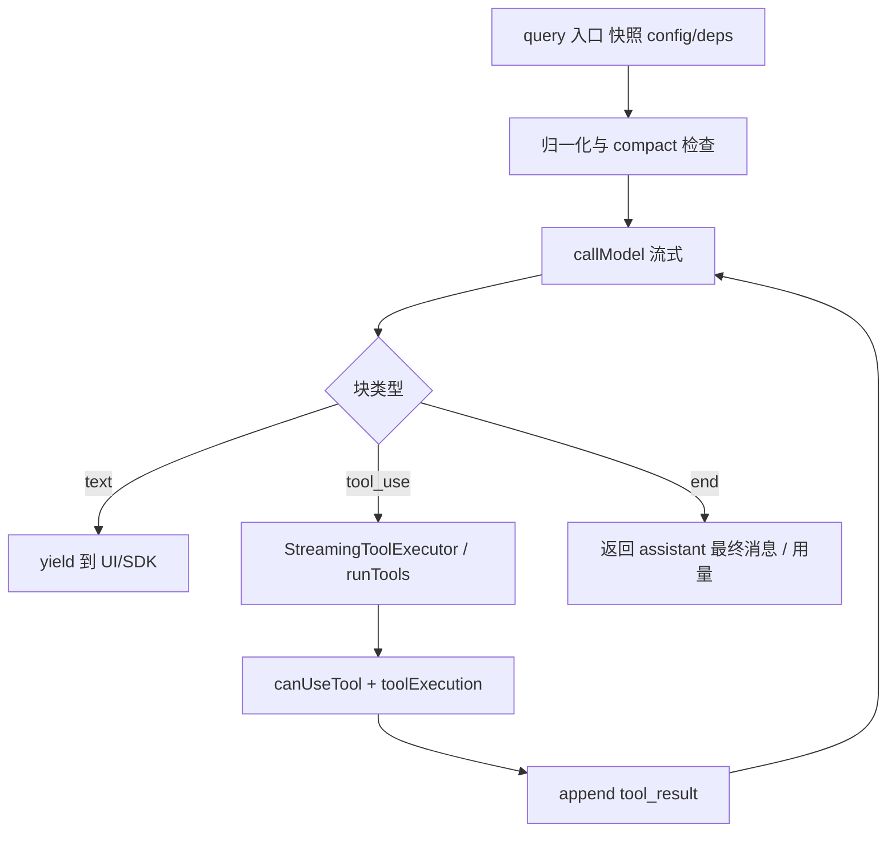

# 03 — QueryEngine 与 query 主循环

## 1. 模块定位与边界

| 项目 | 说明 |
|------|------|
| **职责** | **一轮或多轮用户消息** 的完整生命周期：消息追加、系统提示组装、调用 Claude API、处理流式 tool_use、compact、token 预算、hooks、产出 SDK/REPL 可见事件。 |
| **核心类/函数** | `QueryEngine`（`QueryEngine.ts`）、`query()`（`query.ts`，体积极大）、`query/` 子目录辅助模块 |
| **物理路径** | `src/QueryEngine.ts`、`src/query.ts`、`src/query/*` |

## 2. 设计目标

1. **双入口统一内核**：交互 REPL 与 **headless SDK** 共用同一套 `query()` 逻辑；`QueryEngine` 管理会话级可变状态，避免 SDK 侧重复实现。
2. **可测试依赖注入**：`query/deps.ts` 暴露 `QueryDeps`（`callModel`、`microcompact`、`autocompact`、`uuid`），单测可替换而不必 spy 整个 `claude.ts`。
3. **配置快照**：`query/config.ts` 的 `QueryConfig` 在 `query()` 入口一次性构建，明确 **「每轮查询不变」** 的字段（与 `ToolUseContext` 内可变场景区分）。
4. **未来 step/reducer 化**：`config.ts` 注释说明将 `State` / `event` / `config` 分离，为提取纯 `step()` 做准备。

## 3. `query/` 子目录文件

| 文件 | 职责 |
|------|------|
| `config.ts` | `buildQueryConfig()`：`sessionId`、`gates`（Statsig `tengu_streaming_tool_execution2`、`CLAUDE_CODE_EMIT_TOOL_USE_SUMMARIES`、`USER_TYPE`、`fastMode` 等）。**刻意不收 `feature()` 门控**（门控须在守卫块内联以支持 DCE）。 |
| `deps.ts` | `productionDeps()`：绑定真实 `queryModelWithStreaming`、`microcompactMessages`、`autoCompactIfNeeded`、`randomUUID`。 |
| `tokenBudget.ts` | 与 `bootstrap/state` 协作的轮次输出预算、`createBudgetTracker`、`checkTokenBudget`。 |
| `stopHooks.ts` | 停止/中断时 hook 聚合（`query.ts` import）。 |

**解包说明**：`query.ts` 仍 `import type { Terminal, Continue } from './query/transitions.js'`。当前部分解包目录中 **可能不存在** `query/transitions.ts`，属 artifact 不完整；类型通常描述「是否终止循环 / 是否继续」状态机，读 `query.ts` 内对 `Terminal`/`Continue` 的使用即可还原语义。

## 4. QueryEngine 实现要点

1. **构造**：接收 `QueryEngineConfig`（`cwd`、`tools`、`commands`、`mcpClients`、`canUseTool`、`getAppState`/`setAppState`、`readFileCache`、预算与模型覆盖等）。
2. **会话态字段**：`mutableMessages`、`abortController`、`permissionDenials`、`totalUsage`、`readFileState`、`discoveredSkillNames`、`loadedNestedMemoryPaths` 等（见类成员注释：技能发现 telemetry、嵌套 memory 去重）。
3. **`submitMessage()`**（核心流程概念）：
   - 合并/规范化用户输入（含 `processUserInput`、slash command）。
   - `fetchSystemPromptParts`、memory、`recordTranscript`。
   - 调用 **`query()`** 传入消息列表与 `ToolUseContext`。
   - 以 **AsyncGenerator** 形式 `yield` `SDKMessage`（及 compact、permission 等元事件）。
4. **与 REPL 差异**：SDK 路径可能设置 `snipReplay`、不设置部分 UI 回调；注释说明 `HISTORY_SNIP` 下内存边界行为。

## 5. `query()` 主循环实现过程（逻辑阶段）

以下按 **概念顺序**（非行号顺序）理解 `query.ts`：

1. **入口快照**：`buildQueryConfig()`、`productionDeps()`（或可注入 `deps`）。
2. **消息预处理**：附件、memory prefetch、队列命令、`normalizeMessagesForAPI` 前置逻辑。
3. **自动 compact**：`autoCompactIfNeeded`、prompt 过长处理、`PROMPT_TOO_LONG_ERROR_MESSAGE`。
4. **调用模型**：`deps.callModel` → `queryModelWithStreaming`（流式）。
5. **流式消费**：对 text / thinking / tool_use 块增量处理；若开启 **流式工具执行**（GrowthBook gate），边收边 `StreamingToolExecutor.addTool`。
6. **工具阶段**：`runTools` 或 executor `getRemainingResults`；每条路径经过 `canUseTool`、`runToolUse`（见 `04-工具系统.md`）。
7. **结果写回**：`tool_result` user messages、可选 `toolUseSummary`、`applyToolResultBudget`。
8. **终止条件**：`stop_reason` 非 `tool_use`、max turns、预算耗尽、abort、`handleStopHooks`。
9. **微压缩 / 后处理**：`microcompact`、post sampling hooks、stop failure hooks。

## 6. 与上下游接口

| 下游 | 接口形态 |
|------|-----------|
| `services/api/claude.ts` | `queryModelWithStreaming` |
| `services/compact/autoCompact.ts` | `autoCompactIfNeeded` |
| `services/compact/microCompact.ts` | `microcompactMessages` |
| `services/tools/StreamingToolExecutor.ts` | 流式工具队列 |
| `services/tools/toolOrchestration.ts` | `runTools` 批量 |
| `utils/queryContext.ts` | 系统提示片段 |
| `utils/processUserInput/` | 斜杠命令与本地命令输出 |
| `utils/sessionStorage.ts` | transcript、content replacement |

## 7. 环境变量与 Statsig（摘录）

- `CLAUDE_CODE_EMIT_TOOL_USE_SUMMARIES`：是否发出 tool use 摘要消息。
- `CLAUDE_CODE_DISABLE_FAST_MODE`：`config.gates.fastModeEnabled`。
- Statsig feature gate：`tengu_streaming_tool_execution2` → `streamingToolExecution`。

## 8. 阅读源码建议顺序

1. `QueryEngine.ts`：读类注释 + `submitMessage` 主路径。
2. `query/config.ts`、`query/deps.ts`、`query/tokenBudget.ts`、`query/stopHooks.ts`。
3. `query.ts`：搜索 `runTools`、`StreamingToolExecutor`、`autoCompactIfNeeded`、`yield`。
4. 对照 `entrypoints/agentSdkTypes.ts` 理解对外 `SDKMessage` 形状。
