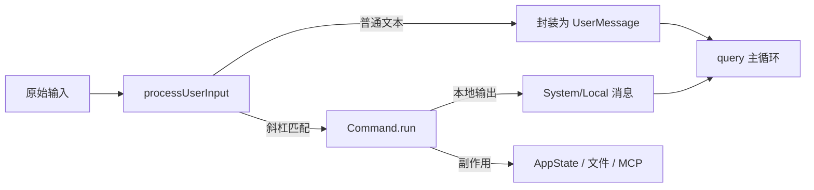

# 05 — 斜杠命令与用户输入处理

## 1. 模块定位与边界

| 项目 | 说明 |
|------|------|
| **职责** | 用户以 **`/` 开头** 的本地命令：解析、执行、可能 **不产生 API 调用** 或产生 **合成消息**；与 `QueryEngine` 的 `processUserInput` 集成。 |
| **核心文件** | `src/commands.ts`（聚合）、`src/commands/**`（各命令实现）、`src/utils/processUserInput/*` |

## 2. 设计目标

1. **可扩展命令表**：每个命令独立模块，导出统一 `Command` 形状（见 `commands.ts` import 模式）。
2. **与工具系统正交**：斜杠命令可以操作设置、MCP、session、compact，而不必经过模型 tool_use。
3. **门控一致**：与 `tools.ts` 相同，内部命令用 `feature('KAIROS')`、`USER_TYPE === 'ant'` 等条件注册，避免外部构建引用缺失模块。

## 3. `commands.ts` 结构

- **大量静态 import**：`./commands/<name>/index.js` 或 `./commands/foo.js`。
- **条件 import 示例**（搜索 `require('./commands/`）：
  - `agentsPlatform` → `USER_TYPE === 'ant'`
  - `proactive` → `PROACTIVE || KAIROS`
  - `assistantCommand`、`briefCommand` → `KAIROS`
  - `bridge` → `BRIDGE_MODE`
  - `remoteControlServerCommand` → `DAEMON && BRIDGE_MODE`
  - `voiceCommand` → `VOICE_MODE`
- **导出**：`getCommands()`、与 remote 模式过滤的 `filterCommandsForRemoteMode`、以及 `getSlashCommandToolSkills` 等与 **Skill 工具** 的桥接。

## 4. 命令目录规模（说明）

`commands/` 下 **80+** 子项，涵盖：

- **认证与账户**：`login`、`logout`、`oauth-refresh`
- **配置**：`config`、`permissions`、`theme`、`keybindings`、`output-style`、`model`、`effort`、`fast`
- **MCP / 插件**：`mcp`、`plugin`、`reload-plugins`、`skills`
- **会话与上下文**：`resume`、`session`、`compact`、`clear`、`context`、`memory`、`rewind`
- **开发工作流**：`commit`、`diff`、`review`、`pr_comments`、`teleport`、`branch`
- **诊断**：`doctor`、`usage`、`cost`、`status`、`debug-tool-call`
- **产品/增长**：`onboarding`、`feedback`、`share`、`install-github-app`
- **隐藏/内部**：`btw`、`stickers`、`good-claude`（与 README「隐藏命令」分析一致）

每个子文件夹通常包含 **`index.ts`/`index.js`**，导出命令元数据、补全、执行函数。

## 5. `processUserInput` 实现过程（概念）

1. **入口**：`QueryEngine.submitMessage` / REPL 在发往 `query()` 前调用 `processUserInput`（见 `QueryEngine.ts` import）。
2. **识别**：判断是否斜杠命令、是否局部命令、是否需要先走队列（`messageQueueManager`）。
3. **分发**：匹配 `Command` 表；可能 **直接修改 `AppState`**、写入 **本地 stdout/stderr 标签消息**（见 `QueryEngine` 中 `LOCAL_COMMAND_STDOUT_TAG`）、或 **返回继续由模型处理** 的 user text。
4. **与 queue 协作**：`getCommandsByMaxPriority`、`notifyCommandLifecycle` 等保证多命令与模型请求的时序（详见 `utils/messageQueueManager.js`）。

## 6. 与上下游接口

| 模块 | 关系 |
|------|------|
| `QueryEngine` | 调用 `processUserInput`，合并结果进 `mutableMessages` |
| `commands.ts` | 提供 `Command[]` 注入 `ToolUseContext.options.commands` |
| `components/PromptInput` | 补全、历史、斜杠提示 |
| `SkillTool` | `getSlashCommandToolSkills` 将部分命令暴露给模型侧「技能」概念 |

## 7. 阅读源码建议顺序

1. `commands.ts` 末尾：命令数组如何组装、`filterCommandsForRemoteMode`。
2. `utils/processUserInput/processUserInput.ts`（主文件）：总流程。
3. 选读 **`commands/help`**、**`commands/config`**、**`commands/mcp`** 三个代表性实现。
4. `utils/messageQueueManager.ts`：与命令优先级相关的边界情况。

## 8. 写模块级文档时的检查清单

- 命令是否 **非交互可用**（`contextNonInteractive` 等变体）。
- 是否修改 **全局 settings** 文件。
- 是否需要 **网络** 或 **子进程**。
