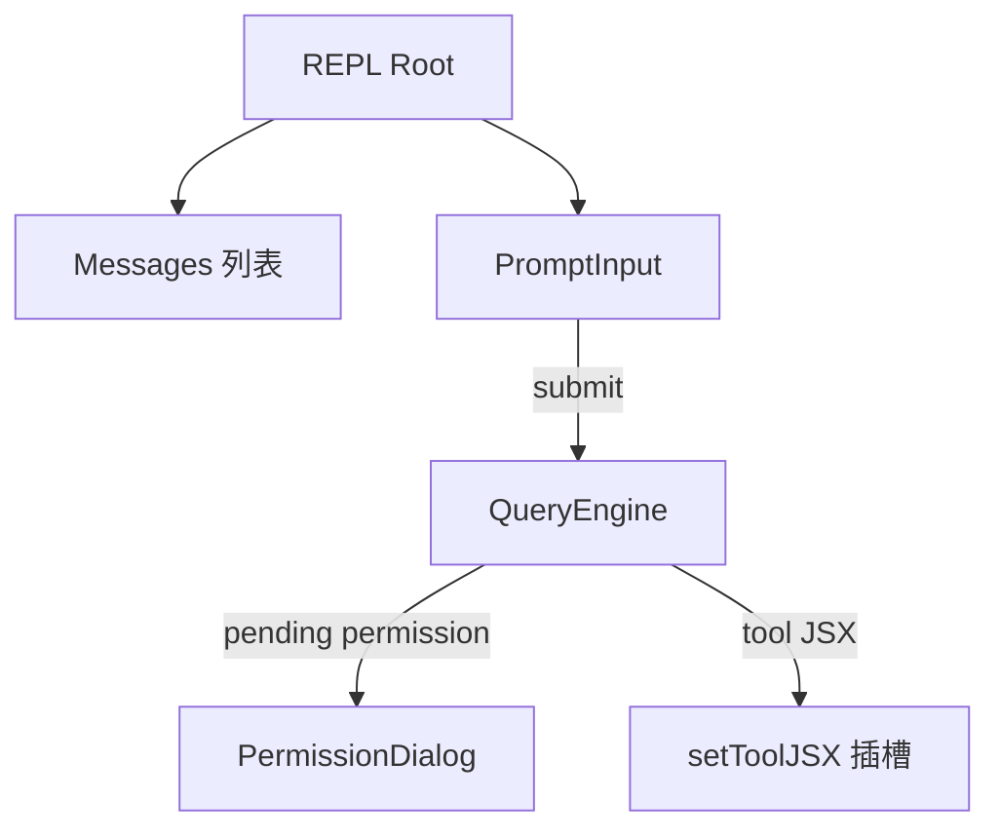

# 07 — 终端 UI 组件层（components + ink）

## 1. 模块定位与边界

| 项目 | 说明 |
|------|------|
| **职责** | 基于 **React + Ink** 的 TUI：消息列表、输入框、权限弹窗、设置向导、任务面板、Logo、Spinner、沙箱与技能菜单等。 |
| **规模** | `components/` 下 **300+** 文件（解包统计），按功能分子目录。 |
| **关联** | `ink/` 提供终端 IO、termio、与渲染选项（`utils/renderOptions`）。 |

## 2. 设计目标

1. **与工具渲染协作**：工具在 `Tool.ts` 中声明 `render*`；通用块在 `components/messages` 统一排版。
2. **权限体验一致**：`components/permissions` 下按工具类型分子组件（文件写、Notebook、WebFetch、PowerShell、Skill、Sandbox…）。
3. **可访问与键盘流**：`PromptInput`、`keybindings` 与 `vim` 模式协同。

## 3. 子目录地图（重点）

| 路径 | 内容 |
|------|------|
| `design-system/` | 复用排版、色彩、排版 token（与设计系统命名一致） |
| `messages/` | 用户/助手/系统/工具消息渲染、折叠、代码块高亮 |
| `PromptInput/` | 输入、建议、footer 药丸、多行、提交 |
| `permissions/` | `PermissionDialog`、各工具专用请求 UI、`rules/` 管理 allow/deny 列表 |
| `Settings/` | 设置面板各 tab |
| `LogoV2/` | 启动品牌与版本信息 |
| `tasks/` | 后台任务列表、`ShellDetailDialog`、`AsyncAgentDetailDialog`、`RemoteSessionProgress` 等 |
| `teams/` | 多 teammate / team 对话框 |
| `skills/` | Skills 菜单 |
| `sandbox/` | 沙箱配置与 doctor 区块 |
| `shell/` | 终端输出行、进度、展开上下文 |
| `wizard/` | 向导框架（Provider、布局、导航脚） |
| `Spinner.tsx` | 全局加载态 |
| `MessageSelector.tsx` | （懒加载）消息筛选，供 `query` 侧 `messageSelector()` require |

## 4. 实现过程（一次用户交互）

1. **Ink Root**：`interactiveHelpers` / `replLauncher` 创建 root，挂载顶层组件（常含 `AppState` Provider）。
2. **REPL 容器**：调度 `messages` 列表渲染；新 `SDKMessage` 或内部消息到达时 setState。
3. **PromptInput**：键盘事件 → 历史 → 提交 → 上层调用 `QueryEngine.submitMessage` 或队列。
4. **权限路径**：`useCanUseTool` 返回 pending → 渲染 `PermissionDialog` → 用户选择 → 解析 Promise → `toolExecution` 继续。
5. **工具 JSX**：工具可 `setToolJSX` 插入全屏/半屏 React 子树（如复杂表单）。

## 5. 与上下游接口

| 上游 | 下游 |
|------|------|
| `Tool.ts` render 方法 | 各 `tools/* / UI.tsx` |
| `hooks/useCanUseTool` | `permissions/*` |
| `state/AppState` | 几乎所有面板 |
| `utils/theme.ts` | 主题色与对比度 |

## 6. 阅读源码建议顺序

1. `components/PromptInput/`：找到提交回调如何传出。
2. `components/messages/`：一条 `AssistantMessage` 如何渲染 tool_use。
3. `components/permissions/PermissionDialog.tsx`：决策如何回传。
4. 任选 `tools/BashTool` 或 `FileReadTool` 同目录 `UI.tsx` 看工具级 UI。

## 7. 性能与工程注意

- **懒 require**：`QueryEngine` 对 `MessageSelector` 使用 `require` 避免测试分片拉入 React 树。
- **大列表**：注意消息列表虚拟化或截断策略（若存在 `MessageList` 相关优化，在具体组件内）。
