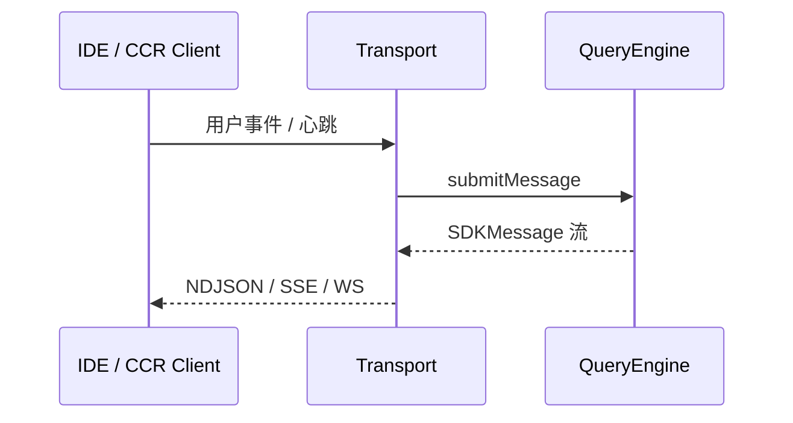

# 09 — CLI 子系统（handlers + transports）

## 1. 模块定位与边界

| 项目 | 说明 |
|------|------|
| **职责** | 非 Ink 全屏路径下的 **子命令实现**（如 `claude mcp`、`claude plugin`）与 **机器可读 I/O**（NDJSON、SSE、WebSocket、混合传输），服务于 IDE 集成、远程 worker、CCR 客户端。 |
| **物理路径** | `src/cli/*` |

## 2. 设计目标

1. **结构化输出**：`structuredIO.ts`、`ndjsonSafeStringify.ts` 保证日志式协议安全（无循环引用、大对象截断策略等）。
2. **传输可插拔**：同一业务逻辑下可换 **stdio / SSE / WS / Hybrid**。
3. **与 entrypoints 快路径分工**：`cli.tsx` 负责是否进入 Node；`cli/handlers` 负责具体子命令行为。

## 3. 文件清单

### 3.1 根文件

| 文件 | 职责 |
|------|------|
| `structuredIO.ts` | 结构化模式下的读写、与 SDK 消息流衔接 |
| `print.ts` | 打印模式格式化 |
| `remoteIO.ts` | 远程会话下的 IO 适配 |
| `update.ts` | CLI 自更新相关 |
| `exit.ts` | 统一退出码 |
| `ndjsonSafeStringify.ts` | NDJSON 安全序列化 |

### 3.2 `handlers/`

| 文件 | 职责 |
|------|------|
| `auth.ts` | 认证子流程 |
| `agents.ts` | agent 子命令 |
| `mcp.tsx` | MCP 管理命令（可能含轻量 Ink） |
| `plugins.ts` | 插件安装/列出 |
| `autoMode.ts` | 自动模式相关 CLI |
| `util.tsx` | 通用工具子命令 |

### 3.3 `transports/`

| 文件 | 职责 |
|------|------|
| `SSETransport.ts` | Server-Sent Events 上传/下载事件 |
| `WebSocketTransport.ts` | 双向实时 |
| `HybridTransport.ts` | 组合多种通道 |
| `ccrClient.ts` | CCR（Claude Code Remote）客户端侧协议 |
| `SerialBatchEventUploader.ts` | 批量事件顺序上传 |
| `WorkerStateUploader.ts` | worker 状态同步 |
| `transportUtils.ts` | 共享工具函数 |

## 4. 实现过程（结构化会话概念）

1. **主进程** 选择 transport（由 argv 或环境决定）。
2. **握手**：可能交换版本、session id、能力位。
3. **事件循环**：读用户输入事件 → 调 `QueryEngine` → 将 `SDKMessage` **序列化** 写出。
4. **背压**：`SerialBatchEventUploader` 等控制批量 flush，避免 stdout 阻塞。

## 5. 与上下游接口

| 模块 | 关系 |
|------|------|
| `main.tsx` `--print` / `--output-format` | 进入 structured 路径 |
| `entrypoints/agentSdkTypes.ts` | 消息类型契约 |
| `utils/userAgent.ts` | 依赖极少的 UA 字符串（注释说明 SDK bundle） |

## 6. 阅读源码建议顺序

1. `cli/structuredIO.ts`：消息泵主循环。
2. 任选 `transports/NDJSON` 相关（若有）或 `SSETransport.ts`。
3. `handlers/mcp.tsx`：看 CLI 如何复用 `services/mcp`。

## 7. 安全与健壮性

- **elicitation**：MCP URL 征求在 headless 模式由 `handleElicitation` 接到 `structuredIO`（见 `ToolUseContext` 注释）。
- **序列化**：注意 `BigInt`、循环引用在 NDJSON 下的行为（读 `ndjsonSafeStringify`）。
