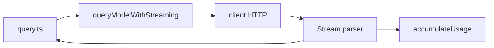

# 10 — API 服务层（Claude Messages API 与 HTTP 客户端）

## 1. 模块定位与边界

| 项目 | 说明 |
|------|------|
| **职责** | 与 **Anthropic Claude API**（及组织相关网关）通信：流式消息、重试、错误分类、用量记录、bootstrap 拉取、文件 API、配额与推荐等。 |
| **物理路径** | `src/services/api/*` |

## 2. 设计目标

1. **流式优先**：`claude.ts` 中 `queryModelWithStreaming` 为 `query/deps` 默认实现，支持 tool_use 增量。
2. **可恢复错误**：`withRetry.ts`、`errors.ts` 区分 rate limit、overload、auth、payload 过大等。
3. **可观测性**：`logging.ts`、`usage.ts`、与 `bootstrap/state` 的 metrics 累加。

## 3. 文件清单（全表）

| 文件 | 职责 |
|------|------|
| `claude.ts` | **核心**：构建请求、处理 stream、累计 `accumulateUsage`/`updateUsage`、与 prompt cache 相关头 |
| `client.ts` | 底层 HTTP/SDK 客户端封装、base URL、auth header |
| `withRetry.ts` | 重试策略、`FallbackTriggeredError` |
| `errors.ts` | `PROMPT_TOO_LONG_ERROR_MESSAGE`、`isPromptTooLongMessage`、`categorizeRetryableAPIError` |
| `errorUtils.ts` | 错误解析辅助 |
| `logging.ts` | 结构化日志字段、`NonNullableUsage`、`EMPTY_USAGE` |
| `emptyUsage.ts` | 零用量常量 |
| `usage.ts` | 用量上报或查询辅助 |
| `bootstrap.ts` | 启动时服务端 bootstrap 数据 |
| `filesApi.ts` | 会话文件下载/解析 `parseFileSpecs` |
| `sessionIngress.ts` | 会话入口/ingress token 相关 |
| `dumpPrompts.ts` | 调试 dump（与 `createDumpPromptsFetch` 在 `query.ts` 使用） |
| `referral.ts` | 推荐预取 `prefetchPassesEligibility` |
| `overageCreditGrant.ts` | 超额积分授予逻辑 |
| `metricsOptOut.ts` | 指标退出 |
| `promptCacheBreakDetection.ts` | 缓存破坏检测 |
| `ultrareviewQuota.ts` | ultrareview 配额 |
| `firstTokenDate.ts` | 首 token 日期记录 |
| `adminRequests.ts` | 内部/管理请求（门控使用） |
| `grove.ts` | 与 Grove 相关产品接口（若启用） |

## 4. 实现过程（一次 `queryModelWithStreaming`）

1. **入参**：归一化后的 `messages`、system、`tools` schema、model、`thinking` 配置、signal。
2. **客户端获取**：`client.ts` 确保 auth（OAuth / API key）有效。
3. **请求发出**：POST Messages API，接受 SSE 或等价流。
4. **事件解析**：`message_start`、delta、`content_block_start/stop`、`message_delta`、`message_stop`。
5. **副作用**：更新 token 计数、记录首 token 时间、检测 prompt cache 命中/断裂。
6. **结束**：返回最终 assistant message + usage + stop_reason；错误抛带类型信息供 `query.ts` 分类。

## 5. 与上下游接口

| 消费者 | 说明 |
|--------|------|
| `query/deps.ts` | 注入 `callModel` |
| `QueryEngine.ts` | 直接 import `accumulateUsage` 等（费用展示） |
| `cost-tracker.ts` | 与 UI 费用对齐 |
| `services/analytics` | 部分事件带 API 元数据（需脱敏） |

## 6. 环境变量与配置（常见）

- 代理、自定义 base URL 多在 `client.ts` 或 `utils/config`（阅读时搜索 `ANTHROPIC`）。
- `CLAUDE_CODE_*` 系列禁用项可能影响 fast mode、重试（交叉 `query/config`）。

## 7. 阅读源码建议顺序

1. `services/api/claude.ts`：找到对外导出的流式函数。
2. `services/api/client.ts`：auth 与实例化。
3. `services/api/withRetry.ts` + `errors.ts`：错误与重试矩阵。
4. `services/api/logging.ts`：usage 结构体字段含义。

## 8. 测试与 Mock

- 单测通过 `QueryDeps.callModel` 替换为 fake stream，避免网络（见 `query/deps.ts` 注释）。
