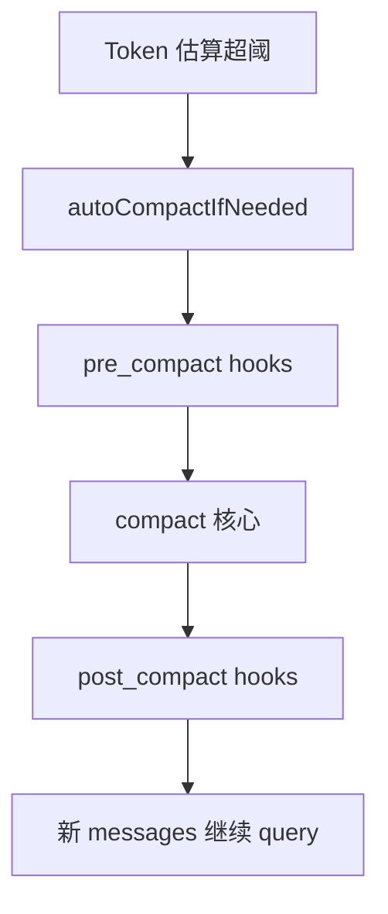

# 11 — 上下文压缩与工具调用摘要服务

## 1. 模块定位与边界

| 项目 | 说明 |
|------|------|
| **职责** | 在 token 压力下 **缩减 messages**（compact / microcompact）、维护压缩边界元数据、向用户展示压缩告警；可选生成 **tool use 摘要** 降低后续轮次噪声。 |
| **路径** | `services/compact/*`、`services/toolUseSummary/*` |
| **不包含** | `feature('HISTORY_SNIP')` 等内部 snip 实现（可能在 monorepo；公开包常 DCE）。 |

## 2. `services/compact/` 文件全表

| 文件 | 职责 |
|------|------|
| `autoCompact.ts` | **自动触发条件**（token 阈值、开关）、与 `query.ts` 循环协同的 `autoCompactIfNeeded` |
| `compact.ts` | 核心压缩：选择保留/丢弃消息、`buildPostCompactMessages`（`query.ts` import） |
| `microCompact.ts` | **轻量**截断/摘要，`microcompactMessages` 作为 `QueryDeps` 一员 |
| `apiMicrocompact.ts` | 与 API 特性相关的 microcompact 变体 |
| `sessionMemoryCompact.ts` | 会话级 memory 与 compact 协同 |
| `timeBasedMCConfig.ts` | 基于时间的 micro-compact 配置 |
| `grouping.ts` | 消息分组策略（相关消息打组再压缩） |
| `prompt.ts` | 压缩用 system/user 提示片段 |
| `postCompactCleanup.ts` | 压缩后清理悬空 tool 结果等 |
| `compactWarningHook.ts` / `compactWarningState.ts` | 压缩前告警、用户确认状态机 |

## 3. 实现过程（auto compact 概念）

1. **`query.ts`** 在每轮 API 前/后调用 `autoCompactIfNeeded`（具体钩子以源码为准）。
2. **判定**：结合 `utils/tokens.ts` 估算、`isAutoCompactEnabled`、用户设置与 fast mode。
3. **执行**：`compact.ts` 生成新消息列表，可能插入 **compact boundary** system 消息（类型见 `agentSdkTypes`）。
4. **Hooks**：`onCompactProgress` 经 `ToolUseContext` 传到 UI（`CompactProgressEvent` 在 `Tool.ts`）。
5. **微压缩**：在高频小消息场景用 `microcompact` 减少往返成本。

## 4. `services/toolUseSummary/`

| 文件 | 职责 |
|------|------|
| `toolUseSummaryGenerator.ts` | 从多轮 tool_result 生成简短摘要（`generateToolUseSummary` 在 `query.ts` 使用） |

**门控**：`query/config.gates.emitToolUseSummaries` 与 env `CLAUDE_CODE_EMIT_TOOL_USE_SUMMARIES`（见 `query/config.ts`）。

## 5. 与上下游接口

| 模块 | 关系 |
|------|------|
| `query.ts` / `query/deps.ts` | 直接调用 autocompact / microcompact |
| `utils/messages.ts` | compact 边界消息构造函数 |
| `utils/hooks` | pre/post compact |
| `QueryEngine` | SDK 侧同样走统一 compact 路径 |

## 6. 阅读源码建议顺序

1. `autoCompact.ts`：触发条件与返回值。
2. `compact.ts`：`buildPostCompactMessages`。
3. `microCompact.ts`：与 `compact` 的差异。
4. `toolUseSummaryGenerator.ts`：输入输出消息类型。

## 7. 风险与注意

- **错误压缩**会导致 tool_use/tool_result 不配；读 `postCompactCleanup.ts`。
- **内部 snip/reactive compact** 在公开源码可能只有 import 桩；勿强行运行。
