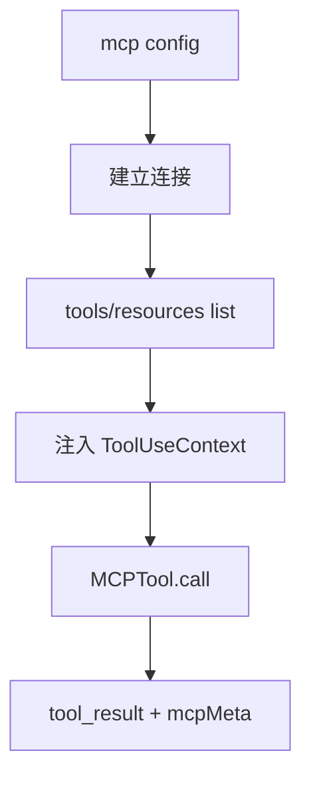

# 12 — MCP（Model Context Protocol）集成服务

## 1. 模块定位与边界

| 项目 | 说明 |
|------|------|
| **职责** | 管理 **MCP Server** 连接生命周期：启动子进程/HTTP 客户端、发现 tools/resources/prompts、OAuth、权限与白名单、**elicitation**（URL 征求）、与 Claude.ai 托管 MCP 通道；把远端工具包装进 **`MCPTool`**。 |
| **物理路径** | `src/services/mcp/*` |
| **工具侧** | `tools/MCPTool`、`ListMcpResourcesTool`、`ReadMcpResourceTool`、`McpAuthTool` |

## 2. 设计目标

1. **多传输**：stdio、HTTP、与 **InProcess**、**SdkControl** 等适配（IDE 内嵌场景）。
2. **安全默认**：`channelAllowlist`、`channelPermissions`、用户批准未知服务器。
3. **与 AppState 同步**：连接列表、elicitation 队列、资源缓存供 UI 展示。

## 3. 文件清单（主要）

| 文件 | 职责 |
|------|------|
| `types.ts` | `MCPServerConnection`、`ServerResource`、配置类型 |
| `client.ts` | **聚合入口**：`getMcpToolsCommandsAndResources`、`prefetchAllMcpResources`、与工具列表合并 |
| `MCPConnectionManager.tsx` | React 侧连接管理 UI 逻辑（含状态机） |
| `config.ts` | 解析用户/项目 `.mcp.json` 等 |
| `auth.ts` / `oauthPort.ts` | MCP OAuth 流程 |
| `elicitationHandler.ts` | 处理 MCP `-32042` URL elicitation，与 `ToolUseContext.handleElicitation` 衔接 |
| `InProcessTransport.ts` | 进程内 MCP 传输 |
| `SdkControlTransport.ts` | SDK 控制面传输 |
| `normalization.ts` / `mcpStringUtils.ts` | 名称与路径规范化 |
| `headersHelper.ts` | 请求头注入 |
| `envExpansion.ts` | 配置中环境变量展开 |
| `officialRegistry.ts` | 官方 MCP 注册表 URL 预取（`main.tsx` 启动期） |
| `claudeai.ts` | Claude.ai 侧 MCP 通道 |
| `vscodeSdkMcp.ts` | VS Code 扩展场景 |
| `xaa.ts` / `xaaIdpLogin.ts` | 企业 IdP 相关 |
| `useManageMCPConnections.ts` | Hook 封装 |
| `mcpServerApproval.tsx` | 首次连接批准 UI |
| `channelAllowlist.ts` / `channelPermissions.ts` / `channelNotification.ts` | 通道级安全与通知 |

## 4. 实现过程（从配置到可用工具）

1. **加载配置**：`config.ts` 读取项目/用户级 MCP 配置，展开 env。
2. **实例化连接**：为每个 server 建 transport（stdio 起子进程或 HTTP client）。
3. **握手**：MCP `initialize`、列举 `tools/list`、`resources/list`。
4. **注入 `ToolUseContext`**：`mcpClients`、`mcpResources` 填入；`refreshTools` 可选用于中途连接新 server。
5. **工具调用**：模型发起 `MCPTool` → `client` 转发 `tools/call` → 结果映射为 `ToolResult` + **mcpMeta**。
6. **Elicitation**：若返回需用户打开 URL 批准，走 `elicitationHandler`；headless 用结构化 IO（见 `Tool.ts` 注释）。

## 5. 与上下游接口

| 模块 | 关系 |
|------|------|
| `main.tsx` | `prefetchOfficialMcpUrls`、`getMcpToolsCommandsAndResources` |
| `tools.ts` | 注册 MCP 相关工具 |
| `commands/mcp` | CLI 管理子命令 |
| `state/AppState` | 连接状态、elicitation 队列 |

## 6. 阅读源码建议顺序

1. `services/mcp/types.ts`：连接对象形状。
2. `services/mcp/client.ts`：对外 API。
3. `tools/MCPTool/MCPTool.ts`（路径以仓库为准）：调用转发。
4. `elicitationHandler.ts`：错误码 `-32042` 路径。

## 7. 运维与调试

- 日志级别与 `DEBUG_MCP` 类环境变量（搜索 `process.env` in `client.ts`）。
- **OAuth 回调端口**冲突时看 `oauthPort.ts`。
