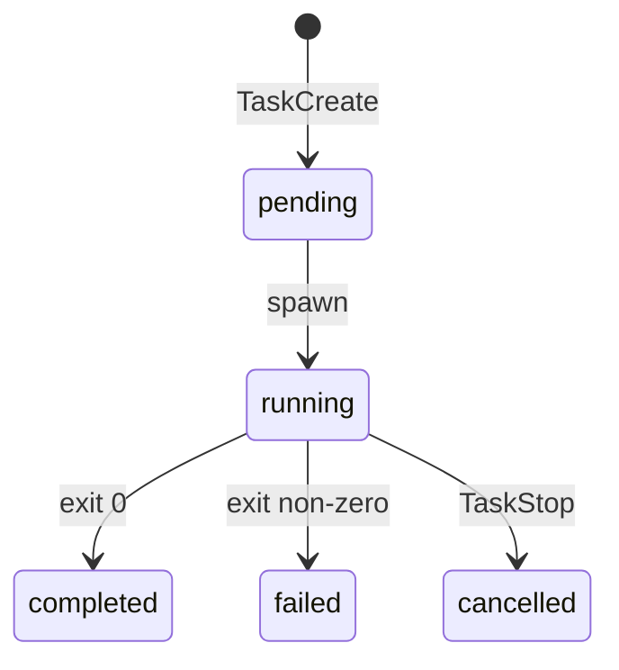

# 15 — 任务系统（Tasks）

## 1. 模块定位与边界

| 项目 | 说明 |
|------|------|
| **职责** | 表示 **长时间运行** 的工作单元：本地 shell、本地子 Agent、远程 Agent、进程内 teammate、Dream 等；与 **TaskCreate/Get/Update/List/Stop/Output** 工具及 UI **任务面板** 对应。 |
| **物理路径** | `src/tasks/*`、展示 `src/components/tasks/*` |

## 2. 设计目标

1. **统一 Task 抽象**：类型在 `tasks/types.ts`，状态进入 `AppState`（`TaskState`）。
2. **可取消**：`stopTask.ts`、Shell `killShellTasks`、AbortSignal 贯通。
3. **进度 observable**：Shell 类通过日志 tail 更新进度（见 `utils/task/TaskOutput.ts`）。

## 3. 实现模块表

| 路径 | 职责 |
|------|------|
| `types.ts` | Task 判别联合、状态枚举、与 `AppState` 对齐 |
| `stopTask.ts` | 统一停止入口 |
| `pillLabel.ts` | UI 药丸标签文案 |
| `LocalShellTask/LocalShellTask.tsx` | 本地 bash 执行、与终端面板协作 |
| `LocalShellTask/guards.ts` | 沙箱/路径守卫 |
| `LocalShellTask/killShellTasks.ts` | 进程组终止 |
| `LocalAgentTask/LocalAgentTask.tsx` | 子 Agent 进程（或嵌入式循环） |
| `RemoteAgentTask/RemoteAgentTask.tsx` | 经 Bridge 的远程执行 |
| `InProcessTeammateTask/` | 同进程 teammate + `types.ts` |
| `DreamTask/DreamTask.ts` | 后台思考任务 |
| `LocalMainSessionTask.ts` | 主会话作为 task 的包装（用于 UI 一致性） |

## 4. 工具映射（见 `04-工具系统.md`）

- `TaskCreateTool` / `TaskGetTool` / `TaskUpdateTool` / `TaskListTool` / `TaskStopTool` / `TaskOutputTool`：CRUD + 输出拉取。
- 工具 `call()` 内部创建/更新 **AppState 内 task 列表**，并触发 `setAppStateForTasks`（保证子 Agent 也能登记任务，见 `ToolUseContext` 注释）。

## 5. 实现过程（创建 Shell Task 概念）

1. 模型调用 `TaskCreateTool` → 解析 command 与环境。
2. `LocalShellTask`  spawn 子进程，注册 **stdout/stderr** 到 `TaskOutput` 文件。
3. UI `ShellProgress` 订阅 tail 事件更新行数/字节。
4. 完成或失败 → 更新 task 状态 → `TaskOutputTool` 可读全文（受权限与大小限制）。
5. 用户取消 → `TaskStopTool` → `killShellTasks`。

## 6. UI 组件（`components/tasks/`）

- `BackgroundTasksDialog.tsx`、`BackgroundTask.tsx`：总览。
- `ShellDetailDialog.tsx`、`AsyncAgentDetailDialog.tsx`、`RemoteSessionDetailDialog.tsx`、`DreamDetailDialog.tsx`：分类型详情。
- `renderToolActivity.tsx`：在消息时间线嵌入任务活动。

## 7. 阅读源码建议顺序

1. `tasks/types.ts`。
2. `TaskCreateTool` + `LocalShellTask.tsx`。
3. `utils/task/TaskOutput.ts`（进度 tail）。
4. `components/tasks/BackgroundTask.tsx`。

## 8. 排障清单

- **僵尸进程**：查 `killShellTasks` 与 signal 处理。
- **远程任务无输出**：查 Bridge 与 `RemoteAgentTask` 事件流。
