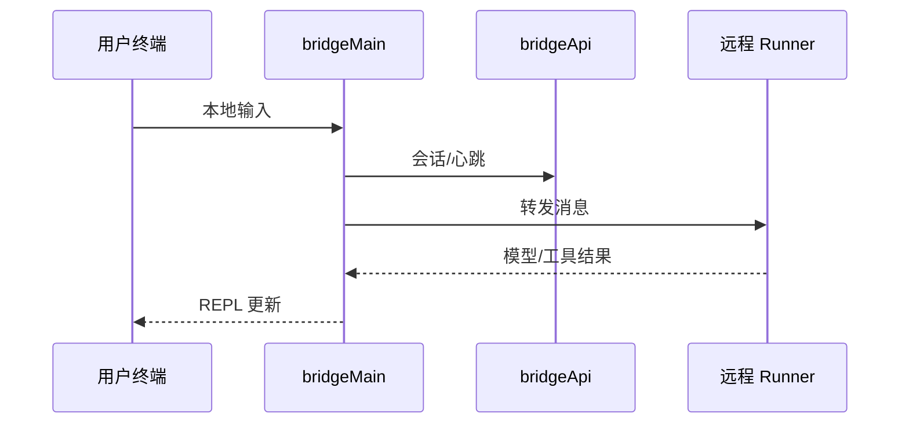

# 16 — Bridge（远程会话与 Desktop 协同）

## 1. 模块定位与边界

| 项目 | 说明 |
|------|------|
| **职责** | 将本地 CLI 会话与 **远程环境** 或 **Claude Desktop** 侧能力桥接：会话创建、JWT、消息双向转发、附件、flush 闸门、容量唤醒、REPL 内 bridge 传输。 |
| **物理路径** | `src/bridge/*` |
| **CLI** | `commands/bridge`（门控 `BRIDGE_MODE`）、`entrypoints/cli.tsx` 子命令快路径 |

## 2. 设计目标

1. **安全传令牌**：`workSecret.ts`、`jwtUtils.ts` 管理短期凭证与刷新。
2. **可靠投递**：`flushGate.ts` 保证消息顺序与落盘点；`bridgeMessaging.ts` 抽象发送语义。
3. **与 AppState 对齐**：连接状态、`bridgePermissionCallbacks` 注入权限决策。

## 3. 文件清单（全表）

| 文件 | 职责 |
|------|------|
| `bridgeMain.ts` | 会话生命周期总管 |
| `bridgeApi.ts` | HTTP API 客户端（创建会话、轮询等） |
| `bridgeConfig.ts` | 连接参数、环境检测 |
| `bridgeMessaging.ts` | 消息封装与派发 |
| `bridgePermissionCallbacks.ts` | 权限回调类型（被 `AppStateStore` import） |
| `bridgeEnabled.ts` / `bridgeStatusUtil.ts` / `bridgeUI.ts` | 功能开关、状态展示 |
| `bridgeDebug.ts` / `debugUtils.ts` | 调试日志 |
| `bridgePointer.ts` | 指针/引用同步（与 UI 焦点相关） |
| `sessionRunner.ts` | 子进程拉起远程 runner |
| `createSession.ts` / `codeSessionApi.ts` | 会话创建协议 |
| `sessionIdCompat.ts` | 会话 ID 版本兼容 |
| `replBridge.ts` / `replBridgeHandle.ts` / `replBridgeTransport.ts` | REPL 内嵌 bridge 传输 |
| `initReplBridge.ts` | 初始化顺序 |
| `jwtUtils.ts` | JWT 解析与刷新 |
| `workSecret.ts` | 工作密钥存储 |
| `trustedDevice.ts` | 可信设备登记 |
| `capacityWake.ts` | 容量/队列唤醒（避免远程侧饿死） |
| `pollConfig.ts` / `pollConfigDefaults.ts` | 轮询间隔默认值 |
| `envLessBridgeConfig.ts` | 无 env 场景配置推断 |
| `inboundMessages.ts` / `inboundAttachments.ts` | 远端→本地入站处理 |
| `remoteBridgeCore.ts` | 核心状态机 |
| `types.ts` | 共享类型 |

## 4. 实现过程（远程控制会话概念）

1. **CLI**：用户执行 `claude remote-control`（或别名）→ `enableConfigs` → 校验版本与策略。
2. **鉴权**：OAuth / work secret → 获取 JWT。
3. **会话**：`createSession` / `codeSessionApi` 在服务端登记。
4. **Runner**：`sessionRunner` 在本地或远程拉起 worker，建立 **WebSocket/SSE**（具体看 `replBridgeTransport`）。
5. **消息**：用户输入经 `bridgeMessaging` 发往远端；远端模型/工具结果经 `inboundMessages` 回注 `messages`。
6. **附件**：`inboundAttachments` 与大文件策略协作。
7. **结束**：flush gate 确保尾部事件送达。

## 5. 与上下游接口

| 模块 | 关系 |
|------|------|
| `hooks/useReplBridge.tsx` | UI 订阅状态 |
| `tasks/RemoteAgentTask` | 远程任务表现 |
| `utils/teleport/*` | 环境跳转相关（组织 UUID 来自 oauth client） |
| `state/AppState` | `remoteSessionUrl`、WS 状态字段 |

## 6. 阅读源码建议顺序

1. `bridge/types.ts` + `bridgeConfig.ts`。
2. `bridgeMain.ts`：主状态机。
3. `bridgeApi.ts` + `jwtUtils.ts`。
4. `replBridgeTransport.ts`：与 Ink REPL 集成点。

## 7. 门控与缺失实现

- **`feature('BRIDGE_MODE')`**：外部构建为 false 时整段 DCE；**`isBridgeEnabled()`** 仍可能做 **运行时** GrowthBook 检查（见 `cli.tsx` 注释）。
- **`remoteControlServer`**：`DAEMON && BRIDGE_MODE`，公开包常无 daemon 实现。
