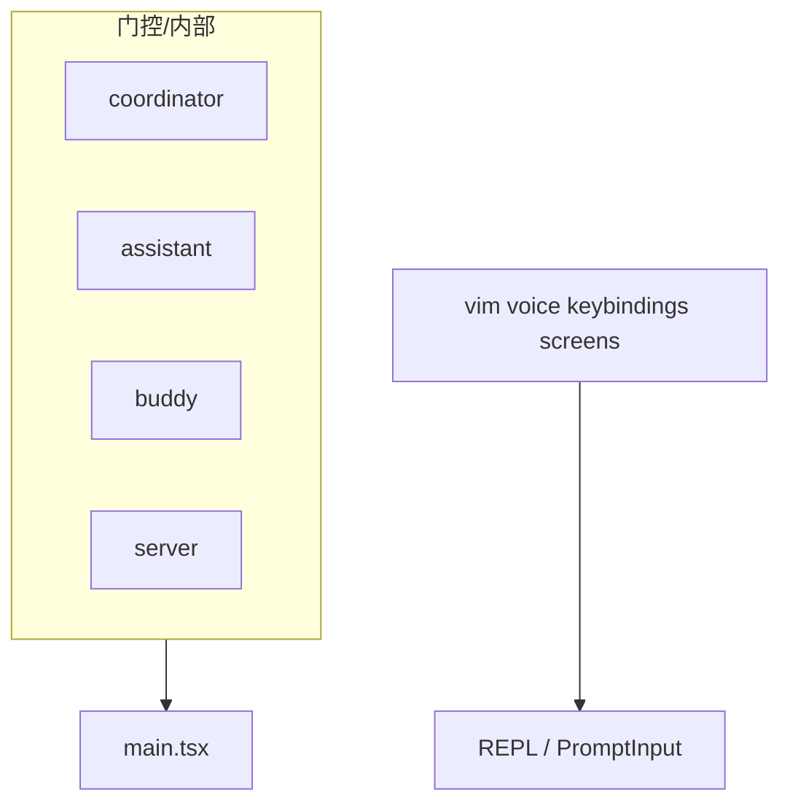

# 20 — 其他目录与内部门控桩

## 1. 说明

`src/` 下除已独立成文模块外，尚有 **终端体验、服务端模式、迁移、实验桩** 等目录。本文说明其 **设计意图** 与 **是否在公开包存在实现**。

---

## 2. `vim/` — 终端 Vim 键位

| 文件 | 职责 |
|------|------|
| `motions.ts` / `operators.ts` / `textObjects.ts` | 类 Vim 动作、操作符、文本对象 |
| `transitions.ts` | 状态转移（**注意**：与 `query/transitions.ts` 不同；后者若解包缺失勿混淆） |
| `types.ts` | 键位与模式类型 |

与 `commands/vim` 协同；影响 `PromptInput` 键盘路由。

---

## 3. `voice/` — 语音模式

- `voiceModeEnabled.ts`：集中判断语音是否开启。
- 与 `services/voice*`、`commands/voice` 组成完整链路；多由 **feature + GrowthBook** 门控。

---

## 4. `keybindings/` — 快捷键配置

- 导出默认绑定与用户覆盖读取；供 `commands/keybindings` 与 `PromptInput` 使用。

---

## 5. `screens/` — 全屏流程 UI

- Setup、onboarding、错误页等 **非 REPL 主界面** 的屏幕（具体组件以目录为准）。

---

## 6. `server/` — 服务端/HTTP 入口（若有）

- 可能承载 **本地 HTTP 服务**（Webhook、health）；用于 KAIROS/remote 等门控场景。公开包可能 **DCE**。

---

## 7. `remote/` — 远程模式辅助

- 与 `CLAUDE_CODE_REMOTE`、容器环境检测配合（ scattered 于 `main`、`utils`）。

---

## 8. `upstreamproxy/` — 上游代理

- 企业代理/网关适配（HTTP CONNECT 等），供 `services/api/client` 间接使用。

---

## 9. `native-ts/` — Native 绑定 TS 层

- 与根目录 `vendor/*-src` 对应，封装 N-API 模块类型。

---

## 10. `outputStyles/` — 输出风格

- 用户可选输出样式（`commands/output-style`），影响消息渲染与导出。

---

## 11. `moreright/` — 内部/实验 UI

- 名称暗示附加面板或营销位；体量小，按 feature 门控。

---

## 12. `buddy/` — Buddy 功能桩

- README 列在内部模块；`feature('BUDDY')` 相关；公开包可能无实现。

---

## 13. `coordinator/` — 多代理协调

- `feature('COORDINATOR_MODE')`：`main.tsx`、`tools.ts` 条件 `require`。
- **公开包常无源文件**；阅读时只看 import 边界与类型。

---

## 14. `assistant/` — KAIROS / Assistant 模式

- `feature('KAIROS')`：`assistant/index.js`、`gate.js` 等。
- 与 `commands/assistant`、`kairosEnabled` AppState 字段联动。

---

## 15. `migrations/` — 数据迁移

- 设置或会话文件 **版本升级** 脚本；启动时可能运行（搜索 `migrations` import）。

---

## 16. `schemas/` — 校验模式

- 见 `19`；可能含设置 JSON Schema。

---

## 17. 阅读策略

1. 先 **`feature()` 或 `process.env`** 搜索目录名。
2. 若无文件：视为 **DCE 桩**，只记依赖方向。
3. 若有文件：从 `index.ts` 或唯一 `.ts` 入口读。

---

## 18. 依赖关系简图

